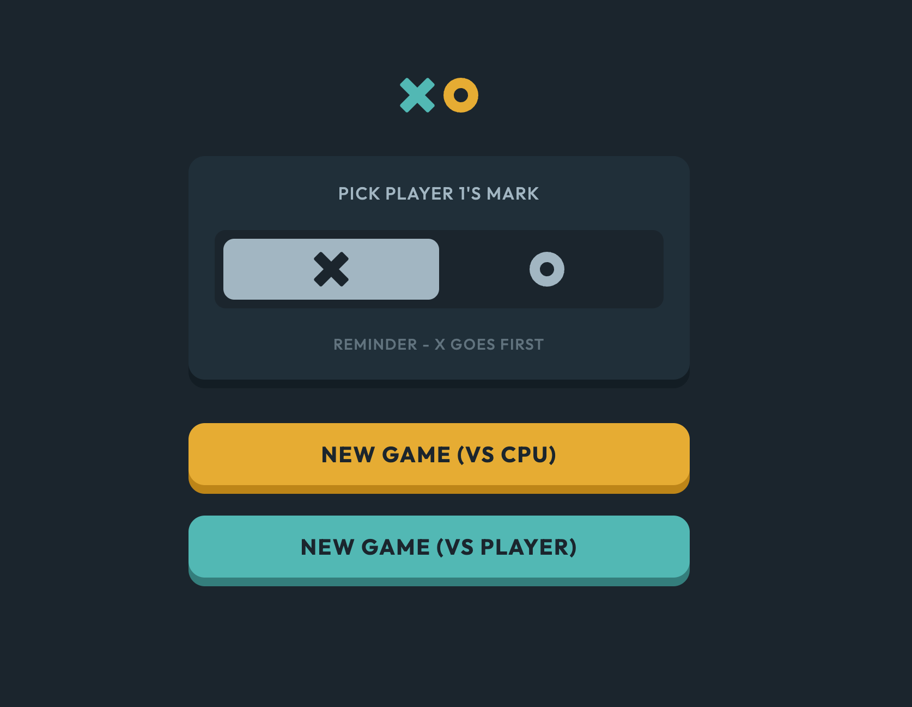

# Frontend Mentor - Tic Tac Toe

### Description

This is a solution to the [Tic Tac Toe challenge on Frontend Mentor](https://www.frontendmentor.io/challenges/tic-tac-toe-game-Re7ZF_E2v).

### Features

- Play vs. CPU or vs. player.
- Choose player 1 marker.

### Built With

- Semantic HTML5.
- CSS.
- Vanilla Javascript.
- BEM.

### Links

- GitHub URL: [https://github.com/norrland90/tic-tac-toe/]
- Live Site URL: [https://norrland90.github.io/tic-tac-toe/]

### Project status

- This is version 1 of the project.
- More simplification may be done. Maybe in the future.

### Contact

Created by [@norrland90](https://github.com/norrland90) - feel free to contact me!
